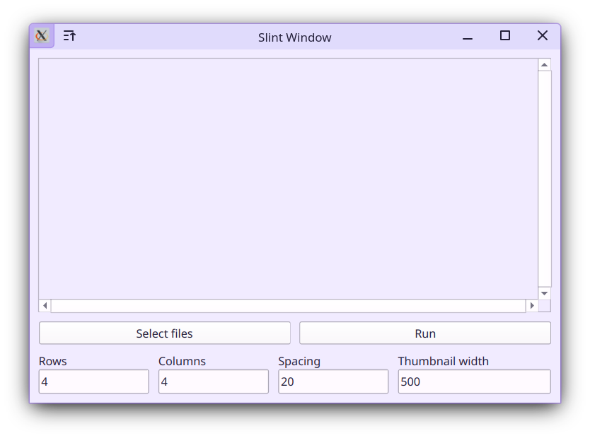

Uses [slint](https://github.com/slint-ui/slint) for the ui and [ffmpeg](https://ffmpeg.org) executables to create the thumbnails. ffmpeg and ffprobe need to be in the PATH.
```
git clone https://github.com/g-fb/kagura
cd ./kagura
cargo run --release
```

The debug version is very slow.